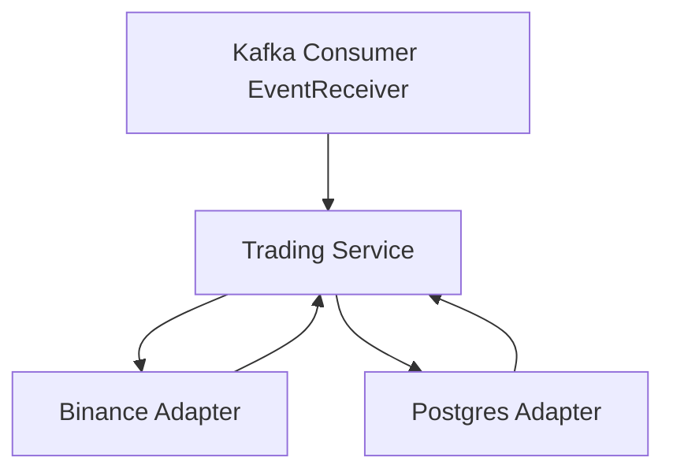

# MarkerTradeIa

MarkerTradeIa is a professional, concurrent trading platform written in Go, designed for high-throughput processing of trading signals, robust trade execution on Binance, and reliable persistence of trade results in PostgreSQL. The system leverages Kafka for scalable, event-driven communication and is architected for extensibility and maintainability.

## Key Features & Concurrency Model

- **Concurrent Batch Processing:** Utilizes Go's goroutines and channels to process trading signals in parallel, maximizing throughput and responsiveness.
- **Fan-Out/Fan-In Pattern:** Signals are distributed (fan-out) to a pool of worker goroutines for trade execution, and results are consolidated (fan-in) for summary and persistence.
- **Batching & Timeouts:** Signals are grouped into batches for efficient processing, with configurable batch size and timeout to ensure timely execution even under low load.
- **Graceful Shutdown:** The system detects channel closure and context cancellation, ensuring all goroutines terminate cleanly and all batches are processed before shutdown.
- **Randomized Simulation:** For testing, the system generates trading signals with randomized price and type, simulating real-world market conditions and concurrency scenarios.

## Architecture Overview

- **Kafka Consumer:** Receives and batches trading signals from the event stream.
- **Trading Service:** Validates, executes, and persists trades, orchestrating the full trade lifecycle.
- **Binance Adapter:** Handles trade execution logic, simulating partial fills, failures, and execution times.
- **Postgres Adapter:** Persists trade execution results for audit and analytics.

## Concurrency & Patterns

The core of MarkerTradeIa's performance is its use of Go concurrency patterns:

- **Fan-Out:** A configurable number of worker goroutines pull signals from a channel and execute trades in parallel.
- **Fan-In:** Results from all workers are collected into a single channel, where they are summarized and persisted.
- **Batching:** Signals are accumulated into batches either by reaching a batch size or after a timeout, ensuring both efficiency and responsiveness.
- **Channel Closure Handling:** All goroutines detect channel closure and process any remaining signals, preventing deadlocks and resource leaks.

## Recent Improvements

- **Deadlock Prevention:** Main now waits for all processing to finish, avoiding infinite blocking and ensuring clean shutdown.
- **Randomized Signal Generation:** Test signals now have random price and type, improving simulation realism.
- **Robust Channel Handling:** All goroutines properly detect and handle closed channels, ensuring no panics or lost signals.
- **Summary Reporting:** Trade execution results are summarized in real time, providing clear feedback on batch outcomes.
- **Professional Logging:** All key events and errors are logged with context for easier debugging and monitoring.

## Flow Diagram



## Main Components

- [`cmd/main.go`](cmd/main.go): Application entrypoint, dependency injection, and lifecycle management.
- [`internal/infrastructure/adapters/kafka/consumer.go`](internal/infrastructure/adapters/kafka/consumer.go): Kafka consumer and batcher.
- [`internal/application/usecases/order/`](internal/application/usecases/order/): Trading service orchestration.
- [`internal/infrastructure/adapters/trading/binance/trader.go`](internal/infrastructure/adapters/trading/binance/trader.go): Binance trade execution logic and simulation.
- [`internal/infrastructure/adapters/repository/tradeAdapter/trade_repository.go`](internal/infrastructure/adapters/repository/tradeAdapter/trade_repository.go): PostgreSQL persistence.
- [`internal/domain/trading_signal.go`](internal/domain/trading_signal.go): Trading signal domain model.
- [`internal/domain/trade_execution.go`](internal/domain/trade_execution.go): Trade execution domain model.

## Example Signal

A trading signal is represented by [`domain.TradingSignal`](internal/domain/trading_signal.go):

```go
type TradingSignal struct {
    ID        string
    Symbol    string
    Price     float64
    Timestamp time.Time
    Type      SignalType
    Strategy  string
}
```

## Running

Build and run the project:

```sh
go build -o markerTradeIa ./cmd
./markerTradeIa
```

## Configuration

See [`config/config.go`](config/config.go) for configuration options.